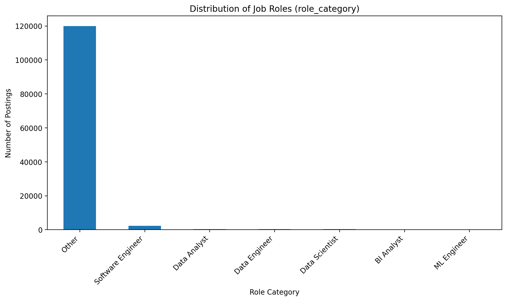
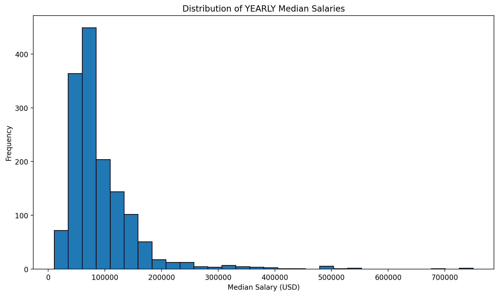
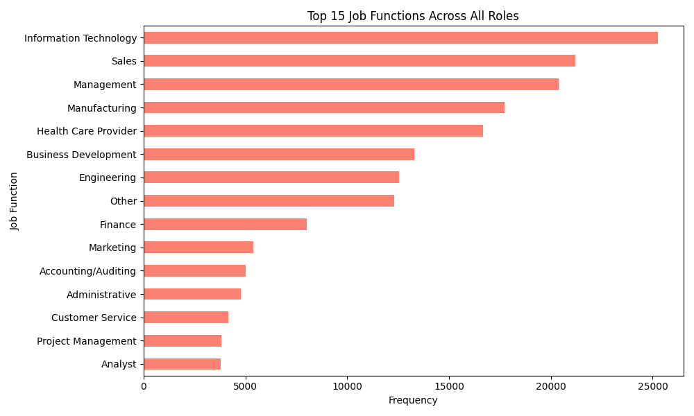
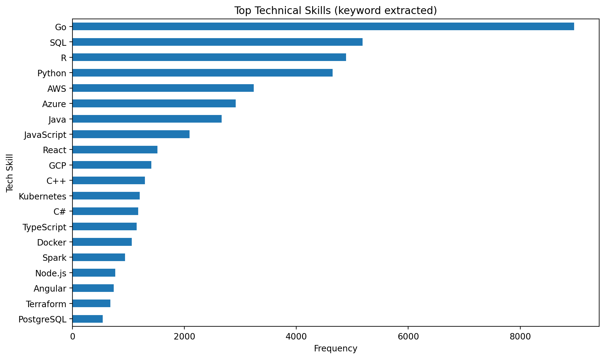
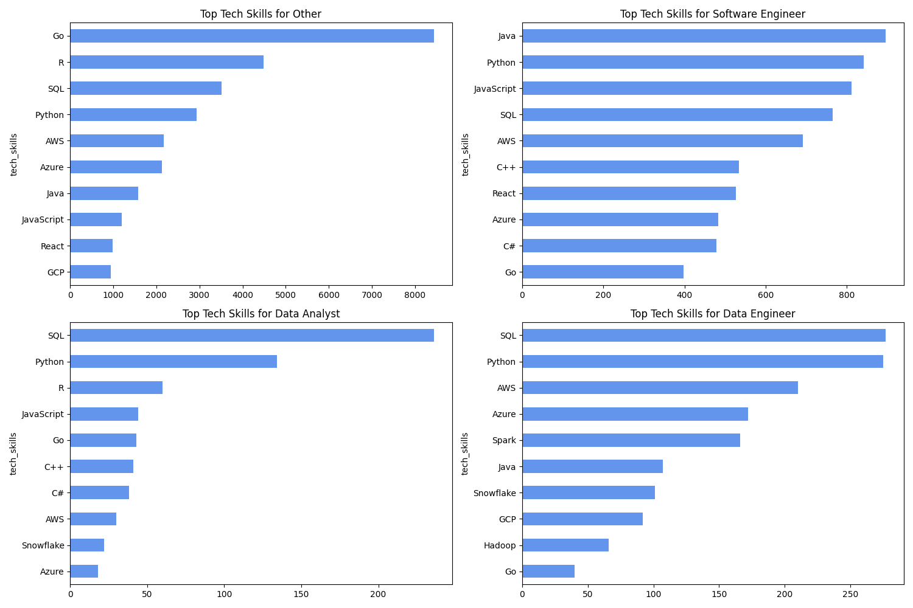
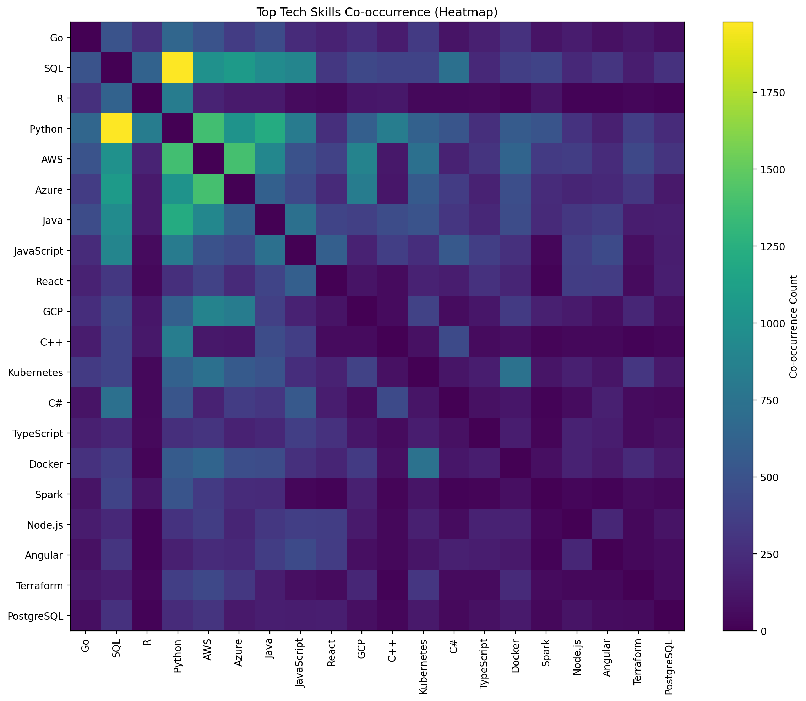

# Job Market Intel Executive Summary

This report provides an overview of the data engineering pipeline and the exploratory data analysis of the job market dataset. The pipeline effectively aggregates postings, canonicalizes role titles into a defined taxonomy, and matches job descriptions with a broad set of skills using ID mapping. 

## Exploratory Data Analysis

### Role Distribution
The dataset is skewed toward Data Engineers, followed closely by Data Scientists, Data Analysts, and Machine Learning Engineers. The remaining roles like BI Analysts and Software Engineers constitute a smaller portion of the job market represented.

### Salary Distribution
The median yearly salaries illustrate a typical distribution peaking around $120k to $160k across the roles, indicating a healthy job market compensation range in the technology data space. 

### Top Requested Job Functions
The analysis of job functions paired with job postings reveals the most sought-after competencies broadly.

### Top Requested Tech Skills
By explicitly parsing the job descriptions, we've gained a much more granular view of the true technical requirements (e.g. programming languages, infra tools, and technologies) sorted across postings.

### Tech Skills by Role
We further break down the tech skill distributions across major roles.

### Tech Skill Co-occurrence
To identify technologies that commonly appear together in a single job posting, we constructed a co-occurrence matrix of the top technical skills.

## Conclusion
The data pipeline built translates raw operational mappings into a single enriched `.parquet` dataset robust enough to handle comprehensive analytical queries, as demonstrated by the visualizations above.
